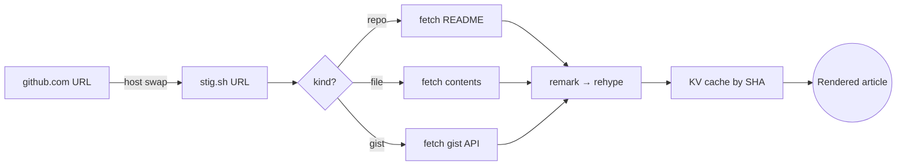
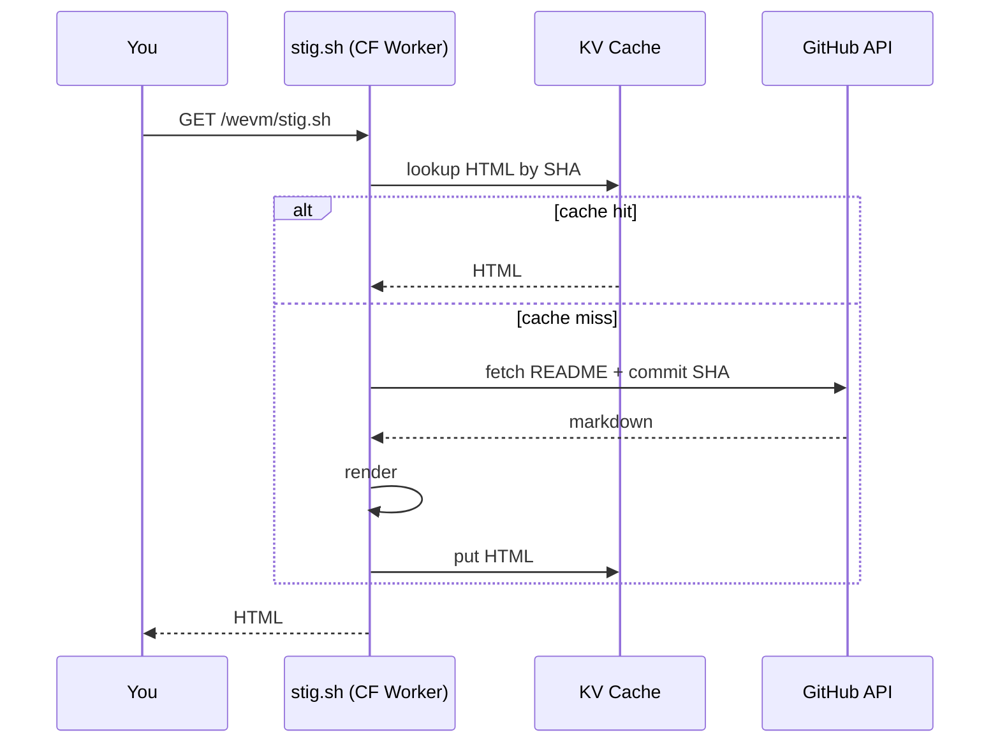

# stig

> Render any GitHub markdown file or gist as a clean, scientific-paper-style article.

Take any GitHub URL, replace `github.com` with **`stig.sh`**, and you get a typeset, single-column, [Computer Modern](https://en.wikipedia.org/wiki/Computer_Modern)–set rendering — the same content, but legible end to end. Works for `README.md`s, `RFC` drafts, gists, multi-file gists, and entire repositories.

## URL mapping

| Source                                              | stig                                  |
| --------------------------------------------------- | ------------------------------------- |
| `github.com/foo/bar`                                | `stig.sh/foo/bar`                     |
| `github.com/foo/bar/blob/main/docs/x.md`            | `stig.sh/foo/bar/blob/main/docs/x.md` |
| `raw.githubusercontent.com/foo/bar/main/x.md`       | `stig.sh/foo/bar/main/x.md`           |
| `gist.github.com/alice/<id>`                        | `stig.sh/alice/<id>`                  |

The shorthand `<owner>/<repo>` (e.g. `stig.sh/wevm/stig.sh`) resolves to the default branch's README.

## What gets rendered

stig accepts the full [GitHub-flavoured Markdown](https://github.github.com/gfm/) surface plus a few extensions for scientific writing.

### Prose, emphasis, links

You can write *italics*, **bold**, ***both***, ~~strikethrough~~, `inline code`, and links — including [autolinks](https://stig.sh) and [reference links][ref].

[ref]: https://github.com/wevm/stig.sh

A footnote[^1] anchors at the bottom of the document.

[^1]: Footnotes are rendered as numbered citations, with backlinks to the cite site.

### Lists

Unordered, ordered, and task lists nest naturally:

- Renders **any** GitHub markdown
  - …including private repos *if* you proxy the request yourself
  - …and gists, single-file or multi-file
- Adds a sidebar for repos that ship a `stig.json`
- Adds a table of contents for long documents

1. Paste a URL
2. Read it
3. Share it

- [x] GitHub-flavoured tables
- [x] Mermaid diagrams
- [x] LaTeX-style math
- [ ] Your idea here

### Block quotes & alerts

> "If you can't explain it simply, you don't understand it well enough."
> — *attributed to Einstein, probably wrongly*

GitHub-style alerts pass through to typed callout blocks:

> [!NOTE]
> stig is purely a renderer. It never writes to GitHub, never stores your content, and caches rendered HTML by commit SHA in Cloudflare KV.

> [!TIP]
> Drop a `stig.json` at your repo root to set a custom title, description, and sidebar.

> [!IMPORTANT]
> Renders are immutable per commit. To force a re-render, push a new commit.

> [!WARNING]
> Non-markdown files (e.g. `LICENSE`, source code) redirect to github.com — stig only renders `.md`, `.mdx`, and `.markdown`.

> [!CAUTION]
> Anonymous GitHub API access is rate-limited to 60 req/h per IP. Set `GITHUB_TOKEN` in production.

### Tables

| Feature              | Library                                                             | Notes                                  |
| -------------------- | ------------------------------------------------------------------- | -------------------------------------- |
| Markdown parser      | [`remark`](https://github.com/remarkjs/remark)                      | with `remark-gfm`, `remark-math`       |
| HTML pipeline        | [`rehype`](https://github.com/rehypejs/rehype)                      | with custom plugins for alerts & links |
| Syntax highlighting  | [`shiki`](https://shiki.style)                                      | JS regex engine, `github-light` theme  |
| Math                 | [`katex`](https://katex.org)                                        | inline and display                     |
| Diagrams             | [`mermaid`](https://mermaid.js.org)                                 | client-side, with click-to-zoom        |

### Code

Fenced code blocks are highlighted with [Shiki](https://shiki.style):

```ts
import * as Source from '#/lib/Source.js'

const source = Source.parse('wevm/stig.sh')

if (source) {
  console.log(Source.toPath(source))
}
```

```python
def stigify(url: str) -> str:
    return url.replace("github.com", "stig.sh")
```

```bash
# Render any repo from the command line
curl -sL https://stig.sh/wevm/stig.sh
```

### Math

stig pipes math through [KaTeX](https://katex.org). Inline math like $E = mc^2$ sits on the baseline; display math sets centred:

$$
\hat{f}(\xi) = \int_{-\infty}^{\infty} f(x)\,e^{-2\pi i x \xi}\,dx
$$

$$
\sum_{n=1}^{\infty} \frac{1}{n^2} = \frac{\pi^2}{6}
$$

### Diagrams

Mermaid blocks render client-side and open in a zoom modal on click:





### Images

Images render with intrinsic dimensions and click-to-zoom:


GitHub's `<picture>` dark-mode variants are flattened to the light source so the page stays consistent with stig's own typography.

### Horizontal rules

---

## Configuration

Drop a `stig.json` at your repository root to customise the rendering:

```json
{
  "title": "My Project",
  "description": "A short, plain-text summary used for OG meta + the page title.",
  "sidebar": [
    { "text": "Introduction", "path": "README.md" },
    { "text": "Architecture", "path": "docs/architecture.md" },
    { "text": "Contributing", "path": "CONTRIBUTING.md" }
  ]
}
```

All fields are optional. Without `sidebar`, the article renders edge-to-edge. With it, the listed files become a fixed left rail (≥1240px) or a collapsible header on smaller screens.